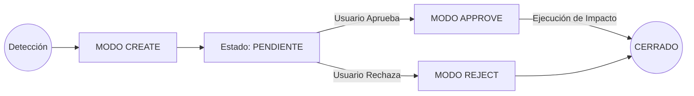

## 🔄 I. Sistema de Estados y Ciclo de Vida

El flujo de un Control de Cambio (CC) es estrictamente secuencial y requiere validación humana en el punto de decisión para garantizar la integridad del sistema.

## 🛠️ II. Modos de Operación

### 1. MODO CREATE — Registro de Incidencia
Se invoca proactivamente al detectar una inconsistencia, error de diseño o nueva solicitud de funcionalidad.

* **Análisis de Impacto:** Evaluar qué pilares de la gobernanza se ven afectados (**Scope**, **Architecture**, **Plan**, **Spec**).
* **Generación de Propuesta:** Presentar en el chat un cuadro resumen con:
    * **ID Correlativo:** `CC_XXXXX` (basado en el índice de auditoría).
    * **Tipo:** (Correctivo | Evolutivo | Estructural).
    * **Razón:** Justificación técnica o de negocio (El "Por qué" del cambio).
    * **Documentos Afectados:** Lista de archivos que requieren modificación.
    * **Implicaciones:** Riesgos asociados en términos de deuda técnica, tiempo de entrega o presupuesto.
* **Persistencia:** Tras confirmación verbal del usuario, crear el archivo físico `docs/changes/CC_XXXXX.md` y actualizar la tabla en `audits/governance/change_index.md` en estado **Pendiente**.

### 2. MODO APPROVE — Ejecución e Invalidación
Se invoca tras la instrucción explícita de aprobación del usuario.

* **Cambio de Estado:** Actualizar el documento local y el índice maestro a estado **✅ Aprobado** con fecha y firma.
* **Invalidación de Tokens (Efecto Cascada):**
    * Si el cambio afecta al Alcance, el archivo `audits/governance/scope_token.md` pasa inmediatamente a **BLOQUEADO (🔴)**.
    * Por seguridad, todos los tokens dependientes (`arch_token`, `plan_token`, `spec_token`) quedan invalidados para forzar una re-auditoría completa del sistema.
* **Ejecución Técnica:** Modificar los archivos base siguiendo estrictamente la jerarquía SDD (**Scope > Architecture > Plan > Spec**).
* **Trazabilidad Bidireccional:**
    * **En el archivo modificado:** Añadir obligatoriamente al final del documento:
        > **Control de Cambio:** Este archivo fue modificado por `CC_XXXXX` el (fecha).
    * **En el Backlog:** Generar las nuevas tareas de implementación bajo el flujo **RED-GREEN-VAL-CERT**.

### 3. MODO REJECT — Cierre por Desestimación
* **Registro:** El archivo `docs/changes/CC_XXXXX.md` pasa a estado **❌ No Aprobado**.
* **Lecciones Aprendidas:** Registrar la razón del rechazo en el índice de cambios para evitar re-discusiones cíclicas sobre la misma funcionalidad.
* **Blindaje:** No se permite realizar ninguna alteración en los archivos base del proyecto.

### 4. MODO LIST — Inventario de Gobernanza
* **Escaneo:** Lectura profunda del archivo `audits/governance/change_index.md`.
* **Reporte:** Presentación de tabla comparativa con: ID, Descripción, Tipo, Pilares Afectados, Estado y Fecha de resolución.

## 🔏 III. Restricciones de Soberanía y Rutas (Storage Guard)

* **Ubicación de Documentos:** Los archivos de detalle viven exclusivamente en `docs/changes/`.
* **Ubicación del Índice:** El registro maestro de auditoría reside en `audits/governance/change_index.md`.
* **Jerarquía de Impacto:** No se puede aprobar un cambio en la Arquitectura si este contradice el Alcance (**Scope**) vigente. Primero debe actualizarse el **Scope**.
* **Soberanía de Tokens:** El proyecto se considera en "Estado Inestable" y no puede avanzar en el Backlog si existen cambios aprobados cuyos tokens de gobernanza siguen **BLOQUEADOS (🔴)**.

## ✅ IV. Auditoría de Calidad (Change Final Check)

Antes de dar por cerrado un Control de Cambio, el protocolo verifica:

- [ ] ¿El cambio fue sometido al escrutinio del "Abogado del Diablo" antes de su creación?
- [ ] ¿Se ha respetado la numeración correlativa `CC_XXXXX`?
- [ ] ¿Se han inyectado las marcas de trazabilidad en los pies de página de los archivos modificados?
- [ ] ¿Se han generado las tareas de TDD (**RED-GREEN-VAL-CERT**) correspondientes en el Backlog?
- [ ] ¿Se han bloqueado los tokens de gobernanza para forzar la re-validación de los documentos maestros?