### # Lista de Tareas — Cimientos y Performance Base (I1-HEALTH)
> **Trazabilidad:** Implementa `docs/governance/PROJECT_plan.md` [v1.0].
> **Filosofía:** TDD Granular (Red → Green → Refactor → Validation → Certification).
> **Regla de Operación:** 1 Tarea = 1 Agente.

### ## Mapa de Dependencias

```mermaid
graph TD
    G01S["[TSK-I0-G01-S] Base Gov"] --> G02A["[TSK-I0-G02-A] Agent Eco"]
    G02A --> G03K["[TSK-I0-G03-K] Repo Kickoff"]
    G03K --> B01R["[TSK-I1-B01-R] Infra Tests"]
    
    B01R --> B01G["[TSK-I1-B01-G] Docker Setup"]
    B01G --> B01RF["[TSK-I1-B01-RF] Clean Setup"]
    B01RF --> B01V["[TSK-I1-B01-V] Val Infra"]
    B01V --> B01C["[TSK-I1-B01-C] Cert Infra"]
    
    B01C --> B02R["[TSK-I1-B02-R] Health Test"]
    B02R --> B02G["[TSK-I1-B02-G] Health Impl"]
    B02G --> B02RF["[TSK-I1-B02-RF] SOP Refactor"]
    B02RF --> B02V["[TSK-I1-B02-V] Val Health"]
    B02V --> B02C["[TSK-I1-B02-C] Cert SOP"]
    
    B02C --> B03R["[TSK-I1-B03-R] RateLimit Test"]
    B03R --> B03G["[TSK-I1-B03-G] RateLimit Impl"]
    B03G --> B03RF["[TSK-I1-B03-RF] Resilience Refactor"]
    B03RF --> B03V["[TSK-I1-B03-V] Val Resilience"]
    B03V --> B03C["[TSK-I1-B03-C] Cert Perf"]
    
    B02C --> F01R["[TSK-I1-F01-R] FE Config Test"]
    F01R --> F01G["[TSK-I1-F01-G] FE Init"]
    F01G --> F01RF["[TSK-I1-F01-RF] Arch Polish"]
    F01RF --> F01V["[TSK-I1-F01-V] Val FE Arch"]
    F01V --> F01C["[TSK-I1-F01-C] Cert FE Arch"]
    
    F01C --> F02R["[TSK-I1-F02-R] UI Logic Test"]
    F02R --> F02G["[TSK-I1-F02-G] Dashboard Impl"]
    F02G --> F02RF["[TSK-I1-F02-RF] UI Code Clean"]
    F02RF --> F02V["[TSK-I1-F02-V] Val UI States"]
    F02V --> F02C["[TSK-I1-F02-C] Cert Visual"]
    
    B03C --> F03R["[TSK-I1-F03-R] Integration Test"]
    F02C --> F03R
    F03R --> F03G["[TSK-I1-F03-G] API Layer Impl"]
    F03G --> F03RF["[TSK-I1-F03-RF] Pattern Refactor"]
    F03RF --> F03V["[TSK-I1-F03-V] Val Integration"]
    F03V --> F03C["[TSK-I1-F03-C] Cert Resilience"]
    
    F03C --> Z01A["[TSK-I1-Z01-A] Stage Audit"]
    Z01A --> Z02S["[TSK-I1-Z02-S] Exec Summary"]
    Z02S --> Z03H["[TSK-I1-Z03-H] Handoff & Lessons"]
    Z03H --> Z04P["[TSK-I1-Z04-P] Final Push"]

    %% Iteration 2 Links
    Z04P --> G201S["[TSK-I2-G01-S] Gov Sync"]

    subgraph Iteration_2["Iteración 2: Registro y Validación"]
        direction TB
        G201S --> B201R["[TSK-I2-B01-R] Auth Schema Red"]
        B201R --> B201G1["[TSK-I2-B01-G1] Persistence Impl"]
        B201G1 --> B201G2["[TSK-I2-B01-G2] Sec/I18N Utils"]
        B201G2 --> B201G3["[TSK-I2-B01-G3] Purge Logic"]
        B201G3 --> B201RF["[TSK-I2-B01-RF] Persistence RF"]
        B201RF --> B201V["[TSK-I2-B01-V] Auth Persistence Val"]
        B201V --> B201C["[TSK-I2-B01-C] Security Cert"]

        B201C --> B202R["[TSK-I2-B02-R] Register Contract Red"]
        B202R --> B202G1["[TSK-I2-B02-G1] DTO & Validations"]
        B202G1 --> B202G2["[TSK-I2-B02-G2] Register Logic"]
        B202G2 --> B202G3["[TSK-I2-B02-G3] Auth Rate Limit"]
        B202G3 --> B202RF["[TSK-I2-B02-RF] Controller RF"]
        B202RF --> B202V["[TSK-I2-B02-V] Register Contract Val"]
        B202V --> B202C["[TSK-I2-B02-C] Privacy Cert"]

        B202C --> B203R["[TSK-I2-B03-R] Verify Logic Red"]
        B203R --> B203G1["[TSK-I2-B03-G1] Verify Account Impl"]
        B203G1 --> B203G2["[TSK-I2-B03-G2] Resend & Queue Impl"]
        B203G2 --> B203RF["[TSK-I2-B03-RF] Email Service RF"]
        B203RF --> B203V["[TSK-I2-B03-V] Workflow Integrity Val"]
        B203V --> B203C["[TSK-I2-B03-C] Auth Logic Cert"]

        B203C --> B204R["[TSK-I2-B04-R] Worker Lifecycle Red"]
        B204R --> B204G["[TSK-I2-B04-G] Worker Impl Green"]
        B204G --> B204RF["[TSK-I2-B04-RF] Worker & Orchestr RF"]
        B204RF --> B204V["[TSK-I2-B04-V] Worker Resilience Val"]
        B204V --> B204C["[TSK-I2-B04-C] Cloud Worker Cert"]

        B204C --> F201R["[TSK-I2-F01-R] Register/Pending Red"]
        F201R --> F201G1["[TSK-I2-F01-G1] Register UI Impl"]
        F201G1 --> F201G2["[TSK-I2-F01-G2] Pending View Impl"]
        F201G2 --> F201RF["[TSK-I2-F01-RF] UI Logic & I18N RF"]
        F201RF --> F201V["[TSK-I2-F01-V] UX Consistency Val"]
        F201V --> F201C["[TSK-I2-F01-C] UX/Visual Cert"]

        F201C --> F202R["[TSK-I2-F02-R] Verify/Resend Red"]
        F202R --> F202G1["[TSK-I2-F02-G1] Verify UI Impl"]
        F202G1 --> F202G2["[TSK-I2-F02-G2] Resend UI Impl"]
        F202G2 --> F202RF["[TSK-I2-F02-RF] Full Stack Refactor"]
        F202RF --> F202V["[TSK-I2-F02-V] Full E2E Validation"]
        F202V --> F202C["[TSK-I2-F02-C] Contract Cert"]

        F202C --> Z201A["[TSK-I2-Z01-A] Stage Audit"]
        Z201A --> Z202S["[TSK-I2-Z02-S] Exec Summary"]
        Z202S --> Z203H["[TSK-I2-Z03-H] Handoff & Lessons"]
        Z203H --> Z204P["[TSK-I2-Z04-P] Final Push"]
    end

    style B01R fill:#f96,stroke:#333
    style B01V fill:#9cf,stroke:#333
    style F03C fill:#f9f,stroke:#333
    style B01RF fill:#ddd,stroke:#333,stroke-dasharray: 5 5
    style Iteration_2 fill:#f5f5f5,stroke:#999,stroke-width:2px
```

---

### ## Bloque 0 — Gobernanza y Kickoff [Etapa 1.0.0]
- [x] `[TSK-I0-G01-S]` **Gobernanza Base**: Construcción y validación de la línea de base documental (Scope, Plan, Architecture, Spec).
    - **Agente responsable**: `Google AntiGravity`
    - **DoD**: Documentos autorizados bajo el protocolo Devil's Advocate; todos los esquemas técnicos validados 1:1.
- [x] `[TSK-I0-G02-A]` **Ecosistema de Agentes**: Perfilado y creación de habilidades para la flota backend, frontend y devops.
    - **Agente responsable**: `Google AntiGravity`
    - **DoD**: Archivos `.agents/*.md` y `skills/*.md` creados y vinculados en `AGENTS.md`.
- [x] `[TSK-I0-G03-K]` **Conectividad y Repo**: Vinculación de GitHub, higiene de `.gitignore` y primer push de línea de base.
    - **Agente responsable**: `Google AntiGravity`
    - **DoD**: Conectividad exitosa con el remoto; repo limpio de temporales y secretos; rama `main` protegida.

---

### ## Bloque 1 — Infraestructura y Entorno [Etapa 1.1.0]
- [x] `[TSK-I1-B01-R]` **Infra Red-Check**: Creación de script de validación de puertos para App, DB y Redis.
    - **Agente responsable**: `backend-tester`
    - **DoD**: Script (utilizando `nc` o `nmap`) confirma ausencia de servicios públicos (Estado RED) y valida específicamente que los puertos 5432 (DB) y 6379 (Redis) deniegan acceso externo directo (Security Red-Check).
- [x] `[TSK-I1-B01-G]` **Dockerization Base**: Configuración de `docker-compose.yml`, entornos de Node.js y plantilla `.env.example`.
    - **Agente responsable**: `devops-integrator`
    - **DoD**: Todos los contenedores levantan con `healthcheck` saludable; el archivo `.env.example` contiene todas las variables de la Spec; generación automática de `.env` inicial con un `X-Health-Key` (UUIDv4) semilla para desarrollo.
- [x] `[TSK-I1-B01-RF]` **Infra Refactor**: Limpieza de archivos Docker e ignorado de secretos.
    - **Agente responsable**: `devops-integrator`
    - **DoD**: `.gitignore` configurado correctamente; implementación obligatoria de Multistage Builds para optimización de imagen final.
- [x] `[TSK-I1-B01-V]` **Infra Validation**: Ejecución de suite de conectividad y persistencia en entorno de integración dockerizado (Container-to-Container).
    - **Agente responsable**: `backend-tester`
    - **DoD**: Reporte de conectividad exitosa entre App-Redis-DB y validación de carga correcta de secretos desde el entorno controlado.
- [x] `[TSK-I1-B01-C]` **Infra Certification**: Auditoría de aislamiento de red y seguridad de entorno.
    - **Agente responsable**: `backend-reviewer`
    - **DoD**: Certificación de cumplimiento de arquitectura Docker y validación de contrato de entorno s/ PROJECT_spec.md.

### ## Bloque 2 — Health API & SOP [Etapa 1.2.0]
- [x] `[TSK-I1-B02-R]` **SOP Format Unit Test**: Crear suite de tests que valide: Regex UUID, ISO-8601 (ms) y Latencia (float-2).
    - **Agente responsable**: `backend-tester`
    - **DoD**: Tests de contrato confirman fallo (RED) por ausencia de lógica; validación obligatoria del Regex UUIDv4 estricto dictado en la Spec (línea 130) para la cabecera `X-Health-Key`.
- [x] `[TSK-I1-B02-G]` **Health Endpoint Green**: Implementación de middleware CORS (Allowed Origins), headers de seguridad (SOP), validación de servicios externos y endpoint `/api/v1/health`.
    - **Agente responsable**: `backend-coder`
    - **DoD**: Endpoint responde JSON s/ Spec; realiza cálculo de latencia acumulada (float-2) por cada servicio y valida `X-Health-Key`.
- [x] `[TSK-I1-B02-RF]` **Health SOP Refactor**: Limpieza de lógica de controlador y aplicación de helpers de respuesta.
    - **Agente responsable**: `backend-coder`
    - **DoD**: Lógica de validación UUID extraída a helper independiente; controlador desacoplado de la lógica de servicios externos.
- [x] `[TSK-I1-B02-V]` **Health Contract Validation**: Ejecución de la suite completa de tests de contrato (Mocha/Jest).
    - **Agente responsable**: `backend-tester`
    - **DoD**: Suite de tests pasa al 100% cubriendo todos los formatos estrictos (UUID, ISO, Latencia) y códigos de error (400, 403, 406); Cobertura de tests unitarios > 90% en lógica de salud.
- [x] `[TSK-I1-B02-C]` **SOP Certification**: Revisión de SOP, cumplimiento de CORS y Negociación de Contenido.
    - **Agente responsable**: `backend-reviewer`
    - **DoD**: Certificación de cumplimiento 100% con esquemas, headers, matriz CORS y SOP dictados en PROJECT_spec.md.

### ## Bloque 3 — Resiliencia y Rate Limiting [Etapa 1.3.0]
- [x] `[TSK-I1-B03-R]` **Load & Resilience Red**: Crear tests de ráfaga (Fixed Window), bypass con llave, caída de DB y caída de Redis.
    - **Agente responsable**: `backend-tester`
    - **DoD**: Pruebas confirman: ausencia de limitación (RED), fallo en bypass de llave, caída de DB y fallo catastrófico/sin-fallback ante caída de Redis (RED esperado).
- [x] `[TSK-I1-B03-G]` **Redis Middleware Green**: Implementar persistencia de Rate Limit y lógica de fallback `SYSTEM_DEGRADED`.
    - **Agente responsable**: `backend-coder`
    - **DoD**: El sistema gestiona contadores en Redis y atrapa excepciones de DB para mutar el payload.
- [x] `[TSK-I1-B03-RF]` **Resilience Refactor**: Aplicación de patrones de resiliencia (Circuit Breaker ligero o Try/Catch centralizado).
    - **Agente responsable**: `backend-coder`
    - **DoD**: Middleware de Rate Limiting desacoplado; lógica de fallback inyectada mediante interceptores de error.
- [x] `[TSK-I1-B03-V]` **Resilience Validation**: Ejecución de tests de estrés y caos (Chaos Engineering ligero).
    - **Agente responsable**: `backend-tester`
    - **DoD**: Tests confirman 429 tras la 10ª petición pública, mientras que con `X-Health-Key` válida se mantiene 200 OK; validación de caos mediante detención manual (`docker stop`) de contenedores Redis/DB resultando en payload 503 SYSTEM_DEGRADED verificado.
- [x] `[TSK-I1-B03-C]` **Performance Certification**: Validación de tiempos de respuesta bajo carga.
    - **Agente responsable**: `backend-reviewer`
    - **DoD**: Certificación de resiliencia (429 activado tras 10 req/min) y latencia media < 200ms (SLA Green) según PROJECT_spec.md.

### ## Bloque 4 — Dashboard de Salud: Estructura [Etapa 1.4.0]
- [x] `[TSK-I1-F01-R]` **Frontend Arch Red**: Test de arquitectura y carga de variables de entorno (Next.js).
    - **Agente responsable**: `frontend-tester`
    - **DoD**: El linter indica inconsistencias y falla el build (RED) por tipos ausentes definidos en PROJECT_spec.md.
- [x] `[TSK-I1-F01-G]` **App Bootstrap Green**: Inicialización de Next.js 15, configuración de TS, Core CSS y definición de interfaces contractuales.
    - **Agente responsable**: `frontend-coder`
    - **DoD**: Aplicación base renderiza Skeleton Loaders; el archivo `types/health.ts` refleja 1:1 la interfaz de la Spec.
- [x] `[TSK-I1-F01-RF]` **FE Arch Refactor**: Limpieza de layout global y eliminación de boilerplate innecesario de Next.js.
    - **Agente responsable**: `frontend-coder`
    - **DoD**: Carpeta `app/` organizada según arquitectura; tipos exportados centralmente; configuración de paths `@/*` verificada.
- [x] `[TSK-I1-F01-V]` **Bootstrap Validation**: Verificación de carga de variables de entorno y consistencia de tipos.
    - **Agente responsable**: `frontend-tester`
    - **DoD**: Reporte de build exitoso; validación de que las `env` se inyectan correctamente y que no hay `any` en los modelos de API.
- [x] `[TSK-I1-F01-C]` **FE Arch Certification**: Auditoría de la estructura de carpetas y stack premium.
    - **Agente responsable**: `frontend-reviewer`
    - **DoD**: Certificación de alineación con PROJECT_architecture.md y contratos de tipos de la PROJECT_spec.md.

### ## Bloque 5 — UI Logic & States [Etapa 1.5.0]
- [x] `[TSK-I1-F02-R]` **UI State Machine Red**: Crear unit tests para transiciones Idle -> Loading -> Success/Error.
    - **Agente responsable**: `frontend-tester`
    - **DoD**: Tests confirman el estado RED al no existir el Hook useHealth, validando la necesidad de impl.
- [x] `[TSK-I1-F02-G]` **Indicators & Dashboard Green**: Implementar componentes de UI y lógicas de visualización vinculadas a Mocks.
    - **Agente responsable**: `frontend-coder`
    - **DoD**: Interfaz visual muestra estados dinámicos para los 4 servicios (DB, Redis, Email, Captcha); los indicadores responden al Hook.
- [x] `[TSK-I1-F02-RF]` **UI Logic Refactor**: Extracción de componentes atómicos y limpieza de hooks personalizados.
    - **Agente responsable**: `frontend-coder`
    - **DoD**: Lógica de presentación separada de la lógica de datos; estilos definidos en componentes de un solo propósito.
- [x] `[TSK-I1-F02-V]` **Visual States Validation**: Test de renderizado de componentes indicadores de salud.
    - **Agente responsable**: `frontend-tester`
    - **DoD**: Validación de que los colores cambian según SLA: Green (<200ms), Warning (200-500ms) y Critical (>500ms o error).
- [x] `[TSK-I1-F02-C]` **Visual Certification**: Validación de diseño premium y micro-animaciones.
    - **Agente responsable**: `frontend-reviewer`
    - **DoD**: Cumplimiento visual 100% vs Spec; validación de micro-animaciones (smooth 60fps) y score de accesibilidad/performance Lighthouse > 90.

### ## Bloque 6 — Capa de Integración & Resiliencia FE [Etapa 1.6.0]
- [x] `[TSK-I1-F03-R]` **Integration Layer Red**: Tests de consumo de API real con intercepción de fallos.
    - **Agente responsable**: `frontend-tester`
    - **DoD**: Tests confirman fallo (RED) en consumo de API real, validando la lógica de error requerida por la Spec.
- [x] `[TSK-I1-F03-G]` **API Layer Impl Green**: Implementar Service Layer y lógica de reintento exponencial (Backoff).
    - **Agente responsable**: `frontend-coder`
    - **DoD**: El dashboard consume `/api/v1/health` real y reintenta automáticamente en caso de 503/429.
- [x] `[TSK-I1-F03-RF]` **Pattern Refactor**: Implementación de interceptores Axios/Fetch y manejo de errores global.
    - **Agente responsable**: `frontend-coder`
    - **DoD**: Lógica de reintento centralizada; manejo de códigos HTTP (429, 503) mapeado a acciones UI globales.
- [x] `[TSK-I1-F03-V]` **Integration Validation**: E2E Tests de flujo de recuperación.
    - **Agente responsable**: `frontend-tester`
    - **DoD**: Simulación de error manual muestra banner de reintento y éxito tras restauración de API.
- [x] `[TSK-I1-F03-C]` **Final Resilience Cert**: Auditoría final de la Iteración 1.
    - **Agente responsable**: `frontend-reviewer`
    - **DoD**: Firma de cumplimiento total: alineación técnica y funcional al 100% con la PROJECT_spec.md.

### ## Bloque 7 — Cierre de Iteración (Stage-Gate) [Etapa 1.7.0]
- [x] `[TSK-I1-Z01-A]` **Auditoría Técnica de Etapa**: Certificar trazabilidad entre Backlog y Código Real.
    - **Agente responsable**: `stage-auditor`
    - **DoD**: Reporte de auditoría generado en `audits/governance/stage_audit_i1.md` confirmando que el 100% de los DoD se han cumplido físicamente en el repositorio.
- [x] `[TSK-I1-Z02-S]` **Cierre Ejecutivo y Valor**: Traducción de hitos técnicos a resumen de negocio para el cliente.
    - **Agente responsable**: `stage-closer`
    - **DoD**: Generación del documento de cierre (Executive Summary) con los logros de la Iteración 1 y el estado de la línea de base.
- [x] `[TSK-I1-Z03-H]` **Handoff & Lecciones Aprendidas**: Consolidación de conocimiento y fricciones técnicas detectadas.
    - **Agente responsable**: `session-closer`
    - **DoD**: Actualización de `docs/governance/PROJECT_handoff.md` y de `docs/governance/PROJECT_lessons.md` para optimizar la Iteración 2.
- [x] `[TSK-I1-Z04-P]` **Sincronización Final (Git Push)**: Empuje final de la etapa consolidada a GitHub.
    - **Agente responsable**: `devops-integrator`
    - **DoD**: Ejecución exitosa del workflow `/git-push` enviando la etapa completa y certificada al repositorio remoto.

---

### # Lista de Tareas — Registro y Validación de Origen (I2-AUTH)
> **Trazabilidad:** Implementa `docs/governance/PROJECT_plan.md` [v1.0].
> **Filosofía:** TDD Granular (Red → Green → Refactor → Validation → Certification).
> **Regla de Operación:** 1 Tarea = 1 Agente.

### ## Bloque 7.5 — Preparación y Gobernanza (I2-GOV) [Etapa 2.0.0]
- [x] `[TSK-I2-G01-S]` **Sincronización de Gobernanza**: Actualización y autorización de `PROJECT_spec.md` y descomposición atómica en `PROJECT_backlog.md` para la Iteración 2.
    - **Agente responsable**: `Google AntiGravity`
    - **DoD**: Documentos sincronizados; `PROJECT_spec.md` contiene todos los contratos de Auth (Register, Verify, Resend); `PROJECT_backlog.md` auditado y certificado con el protocolo `task-document` (RED-GREEN-RF-VAL-CERT).

### ## Bloque 8 — Auth Schema & Security (Persistence Layer) [Etapa 2.1.0]
- [x] `[TSK-I2-B01-R]` **Auth Schema Red**: Crear tests de persistencia para `User` y `AuthToken` incluyendo validación de normalización (Estado RED).
    - **Agente responsable**: `backend-tester`
    - **DoD**: Tests fallan por ausencia de modelos; **assertion mandatoria de campos SOP (version, timestamp) en toda respuesta de error**; validación de campos `email` (unique), `password` (hash string), `birthdate` (Date/ISO), `status` (Enum: UNVERIFIED, ACTIVE) y `deleted_at` (Timestamp); **validación de Clock Mocking para límites de 24h y 7d**; **test de "Lock Collision" (race condition) para el Purge Worker simulando dos instancias concurrentes mediante mock de Redis Lock**; inclusión de casos de borde para mayoría de edad (29 de febrero, cambios de siglo); **test unitario confirma rechazo de password UTF-8 que exceda 128 bytes (ej. emojis pesados)**; **test de regresión para I18N confirma fallback mandatorio a 'es' ante cabeceras No Soportadas (ej. 'ja', 'fr')**.
- [x] `[TSK-I2-B01-G1]` **Auth Persistence Impl**: Crear esquemas de DB y migraciones para `users` y `auth_tokens`.
    - **Agente responsable**: `backend-coder`
    - **DoD**: Modelos creados en DB; registros de prueba persistidos; campo `status` por defecto `UNVERIFIED`; **lógica de validación de edad robusta y paritaria (Plain-Date logic: tratamiento de `birthdate` como string YYYY-MM-DD para evitar desfases de zona horaria; Leap-year aware) incluyendo límite inferior `minDate: 1900-01-01` s/ Spec L295**.
- [x] `[TSK-I2-B01-G2]` **Security & I18N Utils**: Implementar lógica de hashing (Argon2id) y emparejamiento de idioma (I18N).
    - **Agente responsable**: `backend-coder`
    - **DoD**: Argon2id integrado correctamente; rechazo explícito de payloads > 128 bytes antes del hashing; **implementación de matching de idioma basado en prefijos (ej. `es-MX` -> `es`) con fallback automático a 'es' (RNF5)**.
- [x] `[TSK-I2-B01-G3]` **Purge Background Logic**: Implementar lógica del Purge Worker con bloqueos distribuidos.
    - **Agente responsable**: `backend-coder`
    - **DoD**: Implementación del **Purge Worker** (proceso de fondo) con política de ejecución única mediante **Redis Distributed Locking (TTL: 10 min)** y estrategia de "Fail-Fast" ante desconexión de Redis; **bloque de liberación de lock en `finally` garantizado**.
- [x] `[TSK-I2-B01-RF]` **Security Hardening RF**: Implementar hashing de tokens (SHA-256), optimización de índices y **sanitización de logs**.
    - **Agente responsable**: `backend-coder`
    - **DoD**: Los tokens no se guardan en texto plano en la DB; índices creados; **implementación mandatoria de un interceptor de logs que asegure que campos sensibles (`password`, `token`) sean enmascarados (***) en cualquier registro de auditoría o transporte (p.ej. Winston/Bunyan masking)**; **preparación del punto de entrada para el Worker de Purga independiente**.
- [x] `[TSK-I2-B01-V]` **Auth Persistence Val**: Ejecución de suite de tests de integridad referencial y hashing.
    - **Agente responsable**: `backend-tester`
    - **DoD**: Reporte confirma que ningun token es reversible; prueba de normalización confirma que tokens en Mixed-case son válidos tras conversión a lowercase; validación de la purga de 7 días mediante manipulación de reloj (Mock Clock) confirmando borrado exitoso de registros expirados; **validación de resiliencia del Purge Worker mediante simulación de pérdida de conexión a Redis durante el ciclo de ejecución; generación de evidencia en logs estructurados para ciclos de purga exitosos y fallidos**; **validación estricta de rechazo de passwords por peso (> 128 bytes) mediante suite de caracteres multibyte**; **test de paridad de mayoría de edad (29 de febrero) verificado**; cobertura > 90% en capa de datos.
- [x] `[TSK-I2-B01-C]` **Security Architecture Cert**: Auditoría de blindaje de persistencia.
    - **Agente responsable**: `backend-reviewer`
    - **DoD**: Firma de cumplimiento con RNF1; validación de que los tokens son UUIDv4, están normalizados y hasheados en DB s/ PROJECT_spec.md; **certificación de que todas las respuestas de error de persistencia incluyen `version` y `timestamp` (SOP Compliance)**.

### ## Bloque 9 — Registro de Usuario & Safe Registry (Backend) [Etapa 2.2.0]
- [ ] `[TSK-I2-B02-R]` **Register Contract Red**: Crear suite de tests de contrato para `POST /register` incluyendo Rate Limit (Fixed Window).
    - **Agente responsable**: `backend-tester`
    - **DoD**: Tests de contrato fallan (RED); **assertion mandatoria de campos SOP (version, timestamp) en toda respuesta**; validación de 429 tras 5 intentos IP/día; **verificación de que el límite se reinicia exactamente a las 00:00 UTC (Fixed Window)**; inclusión obligatoria de test case para **503 SYSTEM_DEGRADED** ante caída de servicios críticos.
- [ ] `[TSK-I2-B02-G1]` **Register DTO & Validations**: Implementar esquema de entrada y validaciones de negocio.
    - **Agente responsable**: `backend-coder`
    - **DoD**: RegisterDTO creado; validación de `Accepted-Language: es`; reglas de validación para `birthdate` y `password` integradas.
- [ ] `[TSK-I2-B02-G2]` **Register Safe Logic**: Implementar caso de uso con Safe Registry policy y dispatch de evento.
    - **Agente responsable**: `backend-coder`
    - **DoD**: Endpoint responde 201 Created s/ Spec; generación de **UUID v4 aleatorio y único por petición** para `user_id` (dummy) en colisiones s/ Spec (L303); inclusión de `token_expires_at` y manejo de `warning_code: EMAIL_DISPATCH_FAILED`.
- [ ] `[TSK-I2-B02-G3]` **Auth Rate Limit (Redis)**: Implementar algoritmo Fixed Window para límites de registro.
    - **Agente responsable**: `backend-coder`
    - **DoD**: Algoritmo Fixed Window de 24h con reinicio a las 00:00 UTC (TTL calculado dinámicamente) en Redis para límite de 5 req/día; **lógica de cabeceras X-RateLimit-* reportando el par (Remaining, Reset) s/ L16**.
- [ ] `[TSK-I2-B02-RF]` **Rate Limit Refactor**: Inyectar middleware de Rate Limit específico (5/día) y cálculo de cabeceras restrictivas.
    - **Agente responsable**: `backend-coder`
    - **DoD**: Lógica de "Límite más restrictivo" aplicada s/ Spec (L16) comparando el límite global (10/min) vs el específico (5/day); middleware desacoplado de la lógica de negocio.
- [ ] `[TSK-I2-B02-V]` **Register Privacy Val**: Ejecución de tests de penetración para enumeración de usuarios.
    - **Agente responsable**: `backend-tester`
    - **DoD**: Se confirma que un atacante no puede distinguir entre un correo nuevo y uno existente; **validación de que el ID devuelto en colisiones sucesivas para el mismo email es distinto/aleatorio**; validación de `X-RateLimit-Reset` en segundos (Unix Epoch); inmutabilidad de `error_code` (Inglés) vs `message` (Español); validación de respuesta 201 con `warning_code` en fallos de mock de email; **validación de que el ID devuelto es un UUID v4 válido**.
- [ ] `[TSK-I2-B02-C]` **Safe Registry Cert**: Auditoría de privacidad y cumplimiento de contrato.
    - **Agente responsable**: `backend-reviewer`
    - **DoD**: Certificación de cumplimiento 100% con la política de privacidad y esquema de respuesta 201/429 s/ PROJECT_spec.md; **validación de que los errores de registro (Under 18, Weak Password) cumplen con el SOP (Headers, Version, Timestamp)**.

### ## Bloque 10 — Verificación & Resend Logic (Backend) [Etapa 2.3.0]
- [ ] `[TSK-I2-B03-R]` **Auth Workflows Red**: Crear tests unitarios para `/verify` y `/resend` incluyendo gestión de caos, seguridad de token y colisiones de estado.
    - **Agente responsable**: `backend-tester`
    - **DoD**: Tests fallan (RED); **assertion mandatoria de campos SOP (version, timestamp) en todas las respuestas de /verify y /resend**; **test case específico para colisión de cuenta ya activa en el flujo de reenvío**; validación de 405 Method Not Allowed en GET; test de **normalización de tokens** (lowercase); inclusión obligatoria de test case para **503 SYSTEM_DEGRADED** en rumbos críticos; **validación de rechazo (400/405) de tokens enviados via Query Param s/ Spec (L385)**; **test de seguridad confirma que los tokens filtrados en Query Param no quedan persistidos en logs de acceso**.
- [ ] `[TSK-I2-B03-G1]` **Verify Account Impl**: Implementar lógica de activación de cuenta y transaccionalidad.
    - **Agente responsable**: `backend-coder`
    - **DoD**: El estado del usuario cambia a `ACTIVE` tras éxito; **transaccionalidad (ACID) garantizada entre la activación del usuario e invalidación masiva de tokens (soft-delete mediante flag `used_at`)**; normalización mandatoria a lowercase en la entrada de /verify.
- [ ] `[TSK-I2-B03-G2]` **Resend & Queue Impl**: Implementar lógica de reenvío limitado y persistencia de cola en Redis.
    - **Agente responsable**: `backend-coder`
    - **DoD**: `/resend` emite 200 OK genérico; reenvío limitado (3/hr) **utilizando clave compuesta `IP:Email` en Redis**; **implementación de persistencia para la cola de correos (Redis-backed Queue)** para asegurar cumplimiento de RNF6 ante reinicios.
- [ ] `[TSK-I2-B03-RF]` **Email Service Refactor**: Refactorizar Service de Email y maquetación de templates premium.
    - **Agente responsable**: `backend-coder`
    - **DoD**: Captura de fallos SMTP con backoff exponencial s/ RNF6; maquetación de templates HTML premium para emails de verificación y reenvío; (Middleware I18N ya integrado en Bloque 8).
- [ ] `[TSK-I2-B03-V]` **Workflow Integrity Val**: Ejecución de tests de ciclo de vida completo (Register -> Verify -> Login Attempt).
    - **Agente responsable**: `backend-tester`
    - **DoD**: Reporte confirma expiración de tokens tras 24h (mock clock); validación de imposibilidad de usar el mismo token dos veces (409 Already Verified); **test de normalización** confirma que tokens en Mixed-case son válidos tras conversión a lowercase; **confirmación de que tokens en URL fallan sistemáticamente**.
- [ ] `[TSK-I2-B03-C]` **Auth Logic Certification**: Auditoría de lógica de negocio y resiliencia de mailer.
    - **Agente responsable**: `backend-reviewer`
    - **DoD**: Firma de cumplimiento con RNF6 y lógica de seguridad de tokens s/ PROJECT_spec.md; **verificación de atomicidad en la invalidación (soft-delete) de tokens**; **certificación SOP en respuestas 401/410/409**.

### ## Bloque 10.1 — Email Worker Process (Background Logic) [Etapa 2.3.1]
- [ ] `[TSK-I2-B04-R]` **Worker Lifecycle Red**: Crear suite de tests para el consumidor de la cola de emails (Estado RED).
    - **Agente responsable**: `backend-tester`
    - **DoD**: Tests de integración fallan por ausencia de proceso consumidor; validación de procesamiento de reintentos (Retry limit) y manejo de "Dead Letter Queue" ante fallos persistentes.
- [ ] `[TSK-I2-B04-G]` **Worker Implementation Green**: Implementar proceso consumidor independiente que procese la cola de Redis y realice el envío SMTP real.
    - **Agente responsable**: `backend-coder`
    - **DoD**: El proceso levanta como hilo/contenedor independiente; consume eventos de registro; implementa **Exponential Backoff** s/ RNF6; **gestión de señales SIGTERM para cierre gracioso (Graceful Shutdown) procesando el mensaje actual antes de salir**.
- [ ] `[TSK-I2-B04-RF]` **Worker & Orchestration RF**: Configuración del servicio Worker en Docker y limpieza de lógica de transporte.
    - **Agente responsable**: `devops-integrator`
    - **DoD**: `docker-compose.yml` actualizado con el servicio `worker`; uso de la misma imagen de la API pero con comando de entrada independiente (`npm run worker`); aislamiento de red y límites de RAM (max 128MB) configurados; desacoplamiento de la lógica de envío del transporte SMTP.
- [ ] `[TSK-I2-B04-V]` **Worker Resilience Val**: Simular fallos de SMTP y reinicios del proceso.
    - **Agente responsable**: `backend-tester`
    - **DoD**: Evidencia de que los mensajes no se pierden tras un reinicio forzado del worker; el backoff se incrementa correctamente tras cada fallo; validación de cierre gracioso exitoso bajo carga.
- [ ] `[TSK-I2-B04-C]` **Cloud Worker Cert**: Auditoría de orquestación y resiliencia de Workers.
    - **Agente responsable**: `backend-reviewer`
    - **DoD**: Certificación de cumplimiento con RNF6 y aislamiento dockerizado; validación de cuotas de recursos s/ Proyecto.

### ## Bloque 11 — Registro & Vistas de Soporte (Frontend) [Etapa 2.4.0]
- [ ] `[TSK-I2-F01-R]` **Register/Pending Red**: Crear tests unitarios para campos (RNF1/RNF3) y vista de registro pendiente.
    - **Agente responsable**: `frontend-tester`
    - **DoD**: Tests fallan (RED); validación de que el botón de envío está deshabilitado sin `terms_accepted`; definición del test de renderizado para la vista `/auth/verify-pending` s/ Spec L554.
- [ ] `[TSK-I2-F01-G1]` **Register UI Impl**: Crear componente de formulario de registro premium.
    - **Agente responsable**: `frontend-coder`
    - **DoD**: Formulario premium con checklist RNF1; **implementación de paridad absoluta en cálculo de edad con el backend (ISO String comparison YYYY-MM-DD)**; inyección del header `Accept-Language: es`.
- [ ] `[TSK-I2-F01-G2]` **Pending View Impl**: Crear vista de aterrizaje post-registro "Check your email".
    - **Agente responsable**: `frontend-coder`
    - **DoD**: Gestión de `/auth/verify-pending`; redirección mandatoria tras registro exitoso s/ Spec.
- [ ] `[TSK-I2-F01-RF]` **UI Logic & I18N RF**: Refactorizar lógicas de validación a Schemas (Zod) y aplicar internacionalización (es).
    - **Agente responsable**: `frontend-coder`
    - **DoD**: Mensajes de error en español s/ Spec (L651); lógica de validación desacoplada; aplicación de tokens de diseño consistentes; **incorporación estricta del límite de 128 BYTES (medido en UTF-8) en Zod (usando `Blob` o `TextEncoder` para medir peso real)**; **paridad absoluta de cálculo de edad (Leap-year aware) con el backend mediante comparación de años calendario (Plain-Date)**; **centralización de lógica de manejo de errores de API para mapear códigos 400 a estados visuales**.
- [ ] `[TSK-I2-F01-V]` **UX Consistency Val**: Test de accesibilidad y validación de expresiones regulares.
    - **Agente responsable**: `frontend-tester`
    - **DoD**: Score Lighthouse > 90 en Accesibilidad; se confirma que contraseñas débiles bloquean el envío localmente.
- [ ] `[TSK-I2-F01-C]` **UX/Visual Certification**: Auditoría de fidelidad al diseño y cumplimiento de RNF.
    - **Agente responsable**: `frontend-reviewer`
    - **DoD**: Certificación de cumplimiento 100% con RNF1/RNF3 y estándares de diseño premium s/ PROJECT_spec.md; **validación de que los mensajes de error locales coinciden con los del servidor y mantienen el SOP visual**.

### ## Bloque 12 — Landings de Verificación y Reenvío [Etapa 2.5.0]
- [ ] `[TSK-I2-F02-R]` **Verify/Resend Red**: Crear tests para captura de token (Body), vista de reenvío y manejo de expiración.
    - **Agente responsable**: `frontend-tester`
    - **DoD**: Tests fallan (RED); **test de captura y respuesta visual ante 410 Gone (Token Expirado)**; validación de que el token NUNCA se envía via Query Param al backend; definición de tests para la vista `/auth/resend` (Solicitud de email) s/ Spec L561; **test de seguridad verifica que la URL final no contiene el token en el historial del navegador (purgado post-captura)**; utilización obligatoria de Clock Mocking (`cy.clock()`) para validar la liberación del botón de reenvío tras 60s sin esperas reales.
- [ ] `[TSK-I2-F02-G1]` **Verify UI Impl**: Crear vista de procesamiento de token de verificación.
    - **Agente responsable**: `frontend-coder`
    - **DoD**: `/auth/verify` procesa el token via POST Body e implementa **persistencia temporal en `sessionStorage` (Anti-F5 resilience)** y **limpieza inmediata de la URL post-captura**; inyección de `Accept-Language: es`.
- [ ] `[TSK-I2-F02-G2]` **Resend UI Impl**: Crear vista de solicitud de reenvío de token.
    - **Agente responsable**: `frontend-coder`
    - **DoD**: `/auth/resend` implementado con campo de email y bloqueo de botón de 60s tras éxito **persistido en `localStorage` (Anti-F5 bypass)**; redirección al estado "Expired" s/ Spec.
- [ ] `[TSK-I2-F02-RF]` **Full Stack Refactor**: Alineación de toda la comunicación Auth con el SOP Global (Headers, Latencia, Error Handling).
    - **Agente responsable**: `frontend-coder`
    - **DoD**: Interceptores procesan 429 y 503 de auth; los indicadores de salud se mantienen visibles; normalización de respuestas locales; implementación de lógica de notificación específica para el usuario ante `warning_code: EMAIL_DISPATCH_FAILED`.
- [ ] `[TSK-I2-F02-V]` **Full E2E Validation**: Flow de registro completo desde UI hasta DB y activación via UI.
    - **Agente responsable**: `frontend-tester`
    - **DoD**: E2E con Playwright/Cypress confirma flujo exitoso en entorno dockerizado; validación de que el correo de "Ya estás verificado" llega en colisiones.
- [ ] `[TSK-I2-F02-C]` **Contract Certification**: Auditoría final de la Iteración 2.
    - **Agente responsable**: `frontend-reviewer`
    - **DoD**: Firma de cumplimiento total: alineación técnica y funcional al 100% con la PROJECT_spec.md por parte del cliente; **certificación de que el flujo de recuperación de errores (429, 503) en el Front cumple con el SOP global (Retry-After, Banners)**.

### ## Bloque 13 — Cierre de Iteración 2 [Etapa 2.6.0]
- [ ] `[TSK-I2-Z01-A]` **Auditoría Técnica de Etapa**: Certificar cumplimiento de DoD físicos.
    - **Agente responsable**: `stage-auditor`
    - **DoD**: Reporte en `audits/governance/stage_audit_i2.md` con 100% de trazabilidad garantizada.
- [ ] `[TSK-I2-Z02-S]` **Cierre Ejecutivo**: Generación del Resumen de Valor para el cliente.
    - **Agente responsable**: `stage-closer`
    - **DoD**: Documento de cierre destaca la implementación del Registro Seguro y Resiliencia en Email.
- [ ] `[TSK-I2-Z03-H]` **Handoff & Lecciones**: Consolidación de deuda técnica y aprendizajes.
    - **Agente responsable**: `session-closer`
    - **DoD**: `docs/governance/PROJECT_handoff.md` actualizado para Iteración 3 (Login & Captcha).
- [ ] `[TSK-I2-Z04-P]` **Git Push Final**: Sincronización del estado de Iteración 2 al remoto.
    - **Agente responsable**: `devops-integrator`
    - **DoD**: Repositorio en GitHub sincronizado con la versión certificada de I2.

---
*Este backlog se expandirá iteración a iteración. Las tareas completadas serán marcadas con [x] y permanecen como registro de auditoría.*
