### # Lista de Tareas — Cimientos y Performance Base (I1-HEALTH)
> **Trazabilidad:** Implementa `docs/governance/PROJECT_plan.md` [v1.0].
> **Filosofía:** TDD Granular (Red → Green → Refactor → Validation → Certification).
> **Regla de Operación:** 1 Tarea = 1 Agente.

### ## Mapa de Dependencias

```mermaid
graph TD
    G01S["[TSK-I0-G01-S] Base Gov"] --> G02A["[TSK-I0-G02-A] Agent Eco"]
    G02A --> G03K["[TSK-I0-G03-K] Repo Kickoff"]
    G03K --> B01R["[TSK-I1-B01-R] Infra Tests"]
    
    B01R --> B01G["[TSK-I1-B01-G] Docker Setup"]
    B01G --> B01RF["[TSK-I1-B01-RF] Clean Setup"]
    B01RF --> B01V["[TSK-I1-B01-V] Val Infra"]
    B01V --> B01C["[TSK-I1-B01-C] Cert Infra"]
    
    B01C --> B02R["[TSK-I1-B02-R] Health Test"]
    B02R --> B02G["[TSK-I1-B02-G] Health Impl"]
    B02G --> B02RF["[TSK-I1-B02-RF] SOP Refactor"]
    B02RF --> B02V["[TSK-I1-B02-V] Val Health"]
    B02V --> B02C["[TSK-I1-B02-C] Cert SOP"]
    
    B02C --> B03R["[TSK-I1-B03-R] RateLimit Test"]
    B03R --> B03G["[TSK-I1-B03-G] RateLimit Impl"]
    B03G --> B03RF["[TSK-I1-B03-RF] Resilience Refactor"]
    B03RF --> B03V["[TSK-I1-B03-V] Val Resilience"]
    B03V --> B03C["[TSK-I1-B03-C] Cert Perf"]
    
    B02C --> F01R["[TSK-I1-F01-R] FE Config Test"]
    F01R --> F01G["[TSK-I1-F01-G] FE Init"]
    F01G --> F01RF["[TSK-I1-F01-RF] Arch Polish"]
    F01RF --> F01V["[TSK-I1-F01-V] Val FE Arch"]
    F01V --> F01C["[TSK-I1-F01-C] Cert FE Arch"]
    
    F01C --> F02R["[TSK-I1-F02-R] UI Logic Test"]
    F02R --> F02G["[TSK-I1-F02-G] Dashboard Impl"]
    F02G --> F02RF["[TSK-I1-F02-RF] UI Code Clean"]
    F02RF --> F02V["[TSK-I1-F02-V] Val UI States"]
    F02V --> F02C["[TSK-I1-F02-C] Cert Visual"]
    
    B03C --> F03R["[TSK-I1-F03-R] Integration Test"]
    F02C --> F03R
    F03R --> F03G["[TSK-I1-F03-G] API Layer Impl"]
    F03G --> F03RF["[TSK-I1-F03-RF] Pattern Refactor"]
    F03RF --> F03V["[TSK-I1-F03-V] Val Integration"]
    F03V --> F03C["[TSK-I1-F03-C] Cert Resilience"]
    
    F03C --> Z01A["[TSK-I1-Z01-A] Stage Audit"]
    Z01A --> Z02S["[TSK-I1-Z02-S] Exec Summary"]
    Z02S --> Z03H["[TSK-I1-Z03-H] Handoff & Lessons"]
    Z03H --> Z04P["[TSK-I1-Z04-P] Final Push"]

    style B01R fill:#f96,stroke:#333
    style B01V fill:#9cf,stroke:#333
    style F03C fill:#f9f,stroke:#333
    style B01RF fill:#ddd,stroke:#333,stroke-dasharray: 5 5
```

---

### ## Bloque 0 — Gobernanza y Kickoff [Etapa 1.0.0]
- [x] `[TSK-I0-G01-S]` **Gobernanza Base**: Construcción y validación de la línea de base documental (Scope, Plan, Architecture, Spec).
    - **Agente responsable**: `Google AntiGravity`
    - **DoD**: Documentos autorizados bajo el protocolo Devil's Advocate; todos los esquemas técnicos validados 1:1.
- [x] `[TSK-I0-G02-A]` **Ecosistema de Agentes**: Perfilado y creación de habilidades para la flota backend, frontend y devops.
    - **Agente responsable**: `Google AntiGravity`
    - **DoD**: Archivos `.agents/*.md` y `skills/*.md` creados y vinculados en `AGENTS.md`.
- [x] `[TSK-I0-G03-K]` **Conectividad y Repo**: Vinculación de GitHub, higiene de `.gitignore` y primer push de línea de base.
    - **Agente responsable**: `Google AntiGravity`
    - **DoD**: Conectividad exitosa con el remoto; repo limpio de temporales y secretos; rama `main` protegida.

---

### ## Bloque 1 — Infraestructura y Entorno [Etapa 1.1.0]
- [x] `[TSK-I1-B01-R]` **Infra Red-Check**: Creación de script de validación de puertos para App, DB y Redis.
    - **Agente responsable**: `backend-tester`
    - **DoD**: Script (utilizando `nc` o `nmap`) confirma ausencia de servicios públicos (Estado RED) y valida específicamente que los puertos 5432 (DB) y 6379 (Redis) deniegan acceso externo directo (Security Red-Check).
- [x] `[TSK-I1-B01-G]` **Dockerization Base**: Configuración de `docker-compose.yml`, entornos de Node.js y plantilla `.env.example`.
    - **Agente responsable**: `devops-integrator`
    - **DoD**: Todos los contenedores levantan con `healthcheck` saludable; el archivo `.env.example` contiene todas las variables de la Spec; generación automática de `.env` inicial con un `X-Health-Key` (UUIDv4) semilla para desarrollo.
- [x] `[TSK-I1-B01-RF]` **Infra Refactor**: Limpieza de archivos Docker e ignorado de secretos.
    - **Agente responsable**: `devops-integrator`
    - **DoD**: `.gitignore` configurado correctamente; implementación obligatoria de Multistage Builds para optimización de imagen final.
- [x] `[TSK-I1-B01-V]` **Infra Validation**: Ejecución de suite de conectividad y persistencia en entorno de integración dockerizado (Container-to-Container).
    - **Agente responsable**: `backend-tester`
    - **DoD**: Reporte de conectividad exitosa entre App-Redis-DB y validación de carga correcta de secretos desde el entorno controlado.
- [x] `[TSK-I1-B01-C]` **Infra Certification**: Auditoría de aislamiento de red y seguridad de entorno.
    - **Agente responsable**: `backend-reviewer`
    - **DoD**: Certificación de cumplimiento de arquitectura Docker y validación de contrato de entorno s/ PROJECT_spec.md.

### ## Bloque 2 — Health API & SOP [Etapa 1.2.0]
- [x] `[TSK-I1-B02-R]` **SOP Format Unit Test**: Crear suite de tests que valide: Regex UUID, ISO-8601 (ms) y Latencia (float-2).
    - **Agente responsable**: `backend-tester`
    - **DoD**: Tests de contrato confirman fallo (RED) por ausencia de lógica; validación obligatoria del Regex UUIDv4 estricto dictado en la Spec (línea 130) para la cabecera `X-Health-Key`.
- [x] `[TSK-I1-B02-G]` **Health Endpoint Green**: Implementación de middleware CORS (Allowed Origins), headers de seguridad (SOP), validación de servicios externos y endpoint `/api/v1/health`.
    - **Agente responsable**: `backend-coder`
    - **DoD**: Endpoint responde JSON s/ Spec; realiza cálculo de latencia acumulada (float-2) por cada servicio y valida `X-Health-Key`.
- [x] `[TSK-I1-B02-RF]` **Health SOP Refactor**: Limpieza de lógica de controlador y aplicación de helpers de respuesta.
    - **Agente responsable**: `backend-coder`
    - **DoD**: Lógica de validación UUID extraída a helper independiente; controlador desacoplado de la lógica de servicios externos.
- [x] `[TSK-I1-B02-V]` **Health Contract Validation**: Ejecución de la suite completa de tests de contrato (Mocha/Jest).
    - **Agente responsable**: `backend-tester`
    - **DoD**: Suite de tests pasa al 100% cubriendo todos los formatos estrictos (UUID, ISO, Latencia) y códigos de error (400, 403, 406); Cobertura de tests unitarios > 90% en lógica de salud.
- [x] `[TSK-I1-B02-C]` **SOP Certification**: Revisión de SOP, cumplimiento de CORS y Negociación de Contenido.
    - **Agente responsable**: `backend-reviewer`
    - **DoD**: Certificación de cumplimiento 100% con esquemas, headers, matriz CORS y SOP dictados en PROJECT_spec.md.

### ## Bloque 3 — Resiliencia y Rate Limiting [Etapa 1.3.0]
- [x] `[TSK-I1-B03-R]` **Load & Resilience Red**: Crear tests de ráfaga (Fixed Window), bypass con llave, caída de DB y caída de Redis.
    - **Agente responsable**: `backend-tester`
    - **DoD**: Pruebas confirman: ausencia de limitación (RED), fallo en bypass de llave, caída de DB y fallo catastrófico/sin-fallback ante caída de Redis (RED esperado).
- [x] `[TSK-I1-B03-G]` **Redis Middleware Green**: Implementar persistencia de Rate Limit y lógica de fallback `SYSTEM_DEGRADED`.
    - **Agente responsable**: `backend-coder`
    - **DoD**: El sistema gestiona contadores en Redis y atrapa excepciones de DB para mutar el payload.
- [x] `[TSK-I1-B03-RF]` **Resilience Refactor**: Aplicación de patrones de resiliencia (Circuit Breaker ligero o Try/Catch centralizado).
    - **Agente responsable**: `backend-coder`
    - **DoD**: Middleware de Rate Limiting desacoplado; lógica de fallback inyectada mediante interceptores de error.
- [x] `[TSK-I1-B03-V]` **Resilience Validation**: Ejecución de tests de estrés y caos (Chaos Engineering ligero).
    - **Agente responsable**: `backend-tester`
    - **DoD**: Tests confirman 429 tras la 10ª petición pública, mientras que con `X-Health-Key` válida se mantiene 200 OK; validación de caos mediante detención manual (`docker stop`) de contenedores Redis/DB resultando en payload 503 SYSTEM_DEGRADED verificado.
- [x] `[TSK-I1-B03-C]` **Performance Certification**: Validación de tiempos de respuesta bajo carga.
    - **Agente responsable**: `backend-reviewer`
    - **DoD**: Certificación de resiliencia (429 activado tras 10 req/min) y latencia media < 200ms (SLA Green) según PROJECT_spec.md.

### ## Bloque 4 — Dashboard de Salud: Estructura [Etapa 1.4.0]
- [ ] `[TSK-I1-F01-R]` **Frontend Arch Red**: Test de arquitectura y carga de variables de entorno (Next.js).
    - **Agente responsable**: `frontend-tester`
    - **DoD**: El linter indica inconsistencias y falla el build (RED) por tipos ausentes definidos en PROJECT_spec.md.
- [ ] `[TSK-I1-F01-G]` **App Bootstrap Green**: Inicialización de Next.js 15, configuración de TS, Core CSS y definición de interfaces contractuales.
    - **Agente responsable**: `frontend-coder`
    - **DoD**: Aplicación base renderiza Skeleton Loaders; el archivo `types/health.ts` refleja 1:1 la interfaz de la Spec.
- [ ] `[TSK-I1-F01-RF]` **FE Arch Refactor**: Limpieza de layout global y eliminación de boilerplate innecesario de Next.js.
    - **Agente responsable**: `frontend-coder`
    - **DoD**: Carpeta `app/` organizada según arquitectura; tipos exportados centralmente; configuración de paths `@/*` verificada.
- [ ] `[TSK-I1-F01-V]` **Bootstrap Validation**: Verificación de carga de variables de entorno y consistencia de tipos.
    - **Agente responsable**: `frontend-tester`
    - **DoD**: Reporte de build exitoso; validación de que las `env` se inyectan correctamente y que no hay `any` en los modelos de API.
- [ ] `[TSK-I1-F01-C]` **FE Arch Certification**: Auditoría de la estructura de carpetas y stack premium.
    - **Agente responsable**: `frontend-reviewer`
    - **DoD**: Certificación de alineación con PROJECT_architecture.md y contratos de tipos de la PROJECT_spec.md.

### ## Bloque 5 — UI Logic & States [Etapa 1.5.0]
- [ ] `[TSK-I1-F02-R]` **UI State Machine Red**: Crear unit tests para transiciones Idle -> Loading -> Success/Error.
    - **Agente responsable**: `frontend-tester`
    - **DoD**: Tests confirman el estado RED al no existir el Hook useHealth, validando la necesidad de impl.
- [ ] `[TSK-I1-F02-G]` **Indicators & Dashboard Green**: Implementar componentes de UI y lógicas de visualización vinculadas a Mocks.
    - **Agente responsable**: `frontend-coder`
    - **DoD**: Interfaz visual muestra estados dinámicos para los 4 servicios (DB, Redis, Email, Captcha); los indicadores responden al Hook.
- [ ] `[TSK-I1-F02-RF]` **UI Logic Refactor**: Extracción de componentes atómicos y limpieza de hooks personalizados.
    - **Agente responsable**: `frontend-coder`
    - **DoD**: Lógica de presentación separada de la lógica de datos; estilos definidos en componentes de un solo propósito.
- [ ] `[TSK-I1-F02-V]` **Visual States Validation**: Test de renderizado de componentes indicadores de salud.
    - **Agente responsable**: `frontend-tester`
    - **DoD**: Validación de que los colores cambian según SLA: Green (<200ms), Warning (200-500ms) y Critical (>500ms o error).
- [ ] `[TSK-I1-F02-C]` **Visual Certification**: Validación de diseño premium y micro-animaciones.
    - **Agente responsable**: `frontend-reviewer`
    - **DoD**: Cumplimiento visual 100% vs Spec; validación de micro-animaciones (smooth 60fps) y score de accesibilidad/performance Lighthouse > 90.

### ## Bloque 6 — Capa de Integración & Resiliencia FE [Etapa 1.6.0]
- [ ] `[TSK-I1-F03-R]` **Integration Layer Red**: Tests de consumo de API real con intercepción de fallos.
    - **Agente responsable**: `frontend-tester`
    - **DoD**: Tests confirman fallo (RED) en consumo de API real, validando la lógica de error requerida por la Spec.
- [ ] `[TSK-I1-F03-G]` **API Layer Impl Green**: Implementar Service Layer y lógica de reintento exponencial (Backoff).
    - **Agente responsable**: `frontend-coder`
    - **DoD**: El dashboard consume `/api/v1/health` real y reintenta automáticamente en caso de 503/429.
- [ ] `[TSK-I1-F03-RF]` **Pattern Refactor**: Implementación de interceptores Axios/Fetch y manejo de errores global.
    - **Agente responsable**: `frontend-coder`
    - **DoD**: Lógica de reintento centralizada; manejo de códigos HTTP (429, 503) mapeado a acciones UI globales.
- [ ] `[TSK-I1-F03-V]` **Integration Validation**: E2E Tests de flujo de recuperación.
    - **Agente responsable**: `frontend-tester`
    - **DoD**: Simulación de error manual muestra banner de reintento y éxito tras restauración de API.
- [ ] `[TSK-I1-F03-C]` **Final Resilience Cert**: Auditoría final de la Iteración 1.
    - **Agente responsable**: `frontend-reviewer`
    - **DoD**: Firma de cumplimiento total: alineación técnica y funcional al 100% con la PROJECT_spec.md.

### ## Bloque 7 — Cierre de Iteración (Stage-Gate) [Etapa 1.7.0]
- [ ] `[TSK-I1-Z01-A]` **Auditoría Técnica de Etapa**: Certificar trazabilidad entre Backlog y Código Real.
    - **Agente responsable**: `stage-auditor`
    - **DoD**: Reporte de auditoría generado en `audits/governance/stage_audit_i1.md` confirmando que el 100% de los DoD se han cumplido físicamente en el repositorio.
- [ ] `[TSK-I1-Z02-S]` **Cierre Ejecutivo y Valor**: Traducción de hitos técnicos a resumen de negocio para el cliente.
    - **Agente responsable**: `stage-closer`
    - **DoD**: Generación del documento de cierre (Executive Summary) con los logros de la Iteración 1 y el estado de la línea de base.
- [ ] `[TSK-I1-Z03-H]` **Handoff & Lecciones Aprendidas**: Consolidación de conocimiento y fricciones técnicas detectadas.
    - **Agente responsable**: `session-closer`
    - **DoD**: Creación de `PROJECT_handoff.md` y actualización del log de lecciones aprendidas para optimizar la Iteración 2.
- [ ] `[TSK-I1-Z04-P]` **Sincronización Final (Git Push)**: Empuje final de la etapa consolidada a GitHub.
    - **Agente responsable**: `devops-integrator`
    - **DoD**: Ejecución exitosa del workflow `/git-push` enviando la etapa completa y certificada al repositorio remoto.

---
*Este backlog se expandirá iteración a iteración. Las tareas completadas serán marcadas con [x] y permanecen como registro de auditoría.*
